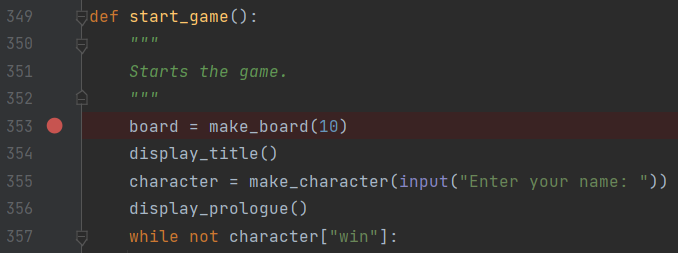
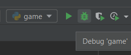

# **How to Use PyCharm's Debugger**

## Why Use the Debugger?

  If you have a large block of code that ends up being very complex, it is useful to look at the code one line at a time. It may also be useful to look at the state of your variables, especially within a recursive function.
  
  PyCharm's debugger is easy to use once you know what everything does. It also works the same way in other JetBrains IDEs like CLion (C/C++) and IntelliJ (Java).

### 1. Select the Line You Want to Examine

### 2. Click on the Left Side

 A red dot will appear next to the line's number.
 This red dot tells the debugger where to stop and examine the code.
 If you don't do this, the code will run normally like when you press the run button.
 

### 3. Click on the Debug Button

 The debug button is to the right of the run button. If you have done the previous step, a terminal will appear.

Now the current line you are examining will be highlighted.  
You will also see five buttons displaying blue arrows near the top of the terminal.  
The next three steps will tell you about the functions you will use the most while in the debugger.

### 4. Stepping Over

 If you click the "step over" button, the debugger immediately examines the next line of code.  
   
 It doesn't matter if there is a function, the debugger will ignore any and all calls to other lines of code and will "step over" to the next line in the program.  
 .gif)

### 5. Stepping Into

 If you click the "step into" button when examining a line with a function call, the debugger will "step into" that function.  
   
 This means you can examine the code that runs within a function call. This is helpful when you are calling multiple functions within one function (eg. main). If there are no function calls in the current line, "step into" simply acts like "step over".  
.gif)

### 6. Stepping Out

 If you click the "step out" button, the debugger will "step out" of the current function.  
   

### 7. 

### 8. 

### 9. 

### 10. 
