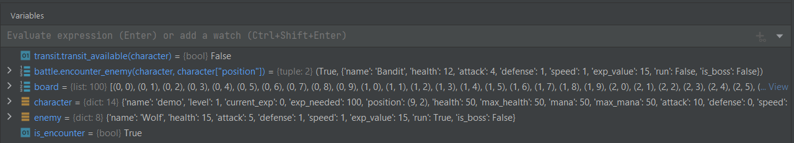

# **How to Use PyCharm's Debugger**

## Why Use the Debugger?

  If you have a large block of code that ends up being very complex, it is useful to look at the code one line at a time. It may also be useful to look at the state of your variables, especially within a recursive function.
  
  PyCharm's debugger is easy to use once you know what everything does. It also works the same way in other JetBrains IDEs like CLion (C/C++) and IntelliJ (Java).

### 1. Select the Line You Want to Examine

### 2. Click on the Left Side

 A red dot will appear next to the line's number.
 This red dot tells the debugger where to stop and examine the code.
 If you don't do this, the code will run normally like when you press the run button.
 

### 3. Click on the Debug Button

 The debug button is to the right of the run button. If you have done the previous step, a terminal will appear.

 
 

 Now the current line you are examining will be highlighted.  
 The next step will give you a short explanation of the terminal.  

### 4. The Debug Terminal

 At the top left corner you will see two tabs, the debugger and the console.
 You will also see the rerun and stop functions along the left side.
 

 The debugger tab will show the values of any variables created.  
 The variables are also displayed in orange text on the line of code they are assigned.
 

 The console is useful for user inputs and print functions.  
 When you reach an input function, you can view the terminal to provide an input.  
 You will know when you can provide input when you see the green ">?" symbol.  
 

 You will also see five buttons displaying blue arrows near the top of the terminal.  
   
 The next three steps will tell you about the functions you will use the most while in the debugger.

### 5. Stepping Over

 If you click the "step over" button, the debugger immediately examines the next line of code.  
   
 It doesn't matter if there is a function, the debugger will ignore any and all calls to other lines of code and will "step over" to the next line in the program.  
 .gif)

### 6. Stepping Into

 If you click the "step into" button when examining a line with a function call, the debugger will "step into" that function.  
   
 This means you can examine the code that runs within a function call. This is helpful when you are calling multiple functions within one function (eg. main). If there are no function calls in the current line, "step into" simply acts like "step over".  
 .gif)

### 7. Stepping Out

 If you click the "step out" button, the debugger will "step out" of the current function.  
 

 This is useful when you are only looking at one part of a long function and need to return to the function call quickly.
 .gif)

### 8. Adding Watches (Watches Part 1)

 Sometimes you need to check a value not assigned to a variable.
 What you need to add is a watch.

 

 Watches act like regular variables but unlike variables, they are not explicitly assigned.
 These next steps will show you how to add your own watches to the debug console.

### 9. Select a Line of Code (Watches Part 2)

 Highlight a line of code that returns a value and copy it.  
 These are most commonly found in if statements that call functions though they can be found in other places.  
   

### 10. Add Watch to the Debugger (Watches Part 3)

 Paste that line of code in the text input line of the variables section of the debugger and click "Add to Watches".
 

 You have successfully added a watch to your variables list!  
 Here is a video guide on how to do it.
 .gif)
