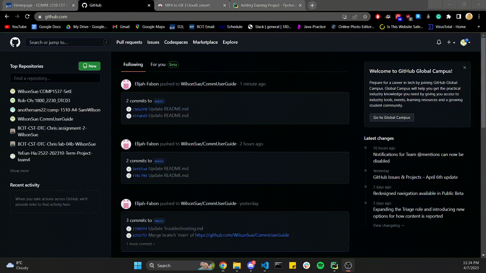
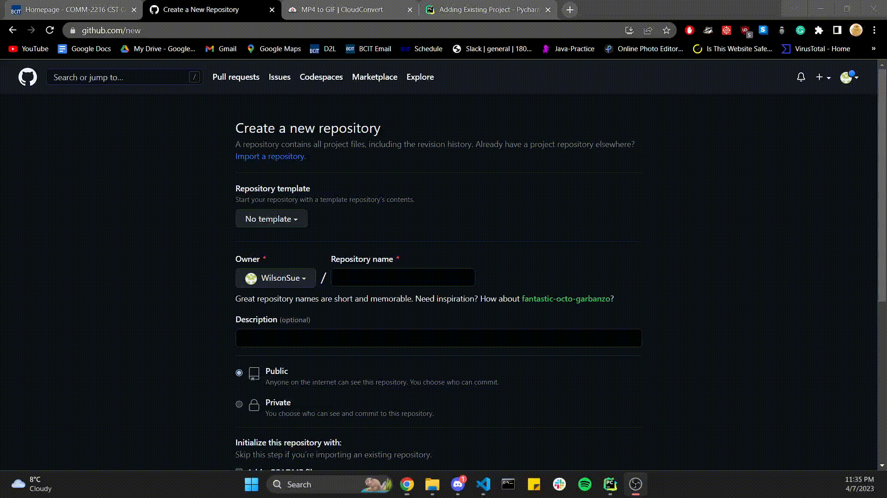
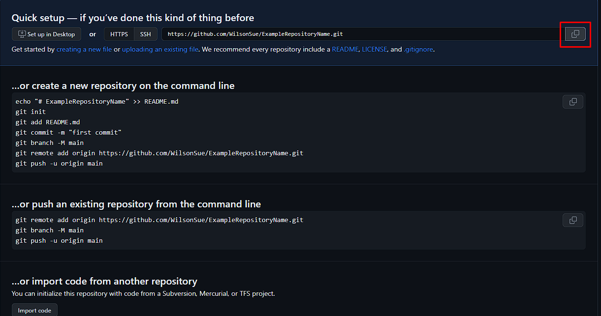
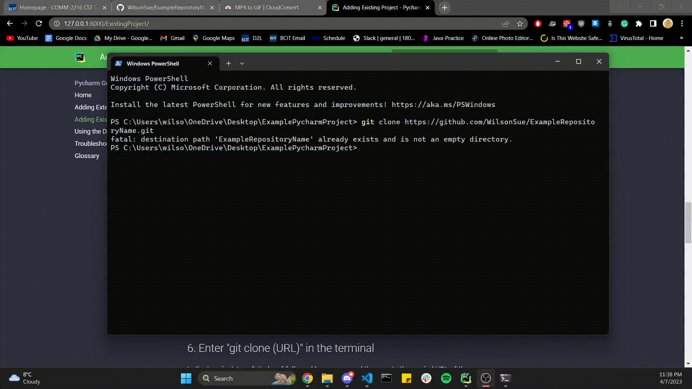
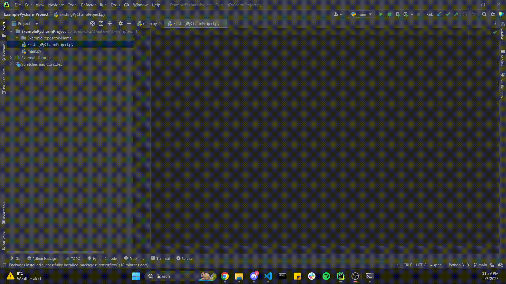

# **How to add Existing Pycharm Projects to GitHub**

## What is GitHub?

GitHub is a web-based hosting service for version control using Git. It offers all of the distributed version control and source code management (SCM) functionality of Git as well as adding its own features. You can refer to our glossary on what is version control

## Why add your project to GitHub?

In group projects, as a software developer it's quintessential to share your work with others.

- Thus, adding your project to Github allows you to share your work with others and collaborate with them.

- Also, Github allows users to revert changes, track the code history, and have multiple versions of a project.

- Lastly, it's a portfolio for your projects which can be shared to potential employers.

Now that you've seen the benefits, let's get started!

## 1. How to add your existing PyCharm project to GitHub

The first step is to enter the GitHub website (<https://github.com/>).

## 2. Click the "+" sign

The "+" Sign can be found at the top right corner of the page and you’ll see a drop down menu. Click on the first option that says  “New repository”.

## 3. Enter the title for your repository

Optionally, you can add a readme.md and .gitignore file. A readme.md file is a text file that contains information about your project. A .gitignore file is a text file that tells Git which files or folders to ignore in a project. For example, if you have a folder that contains files that are not needed for your project, you can add the folder name to the .gitignore file so that Git will ignore the folder and its contents.

## 4. Click on the copy button to copy the URL of your repository

 To copy your Github repository click on the double square button on the right side.

## 5. Enter the folder you want to place your repository inside of

Once you've done that, right click and select the “Open in terminal” option in the drop down menu.

## 6. Enter "git clone (URL)" in the terminal

In the terminal, type "git clone" followed by a space and then paste the copied URL of the repository. Hit "Enter" to clone the repository to your local machine. Note that the (URL) is substituted with the URL of your repository.

Once you've done that, you'll see a new folder in your project directory. This folder contains all the files and folders from your Github directory.

## 7. Add your PyCharm Projects to your GitHub Repository

You can do so by dragging the files and folders from your project directory into the repository folder in PyCharm. This will add your project files to the Git repository.  

## 8. Commit your files to GitHub

Once you have added the files, a popup window will ask if you want to add the file(s) to github in PyCharm. Click on add so you can commit the file. The file text should be green.

## 9. Push your files to GitHub

Once you’ve selected all the files, write a commit message in the box. Then click the “Commit and Push” button to add the files to your github repository.

Great Job :satisfied:! Your existing PyCharm project is now added to Git and any changes in the PyCharm project will be tracked, and can be pushed to your remote repository on GitHub :white_check_mark:.

