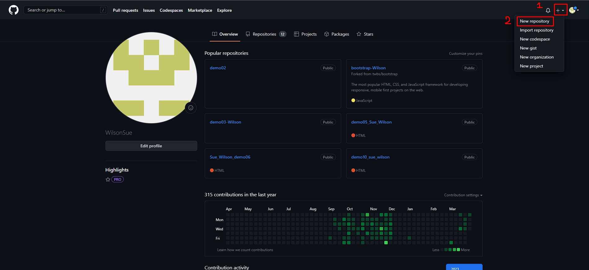
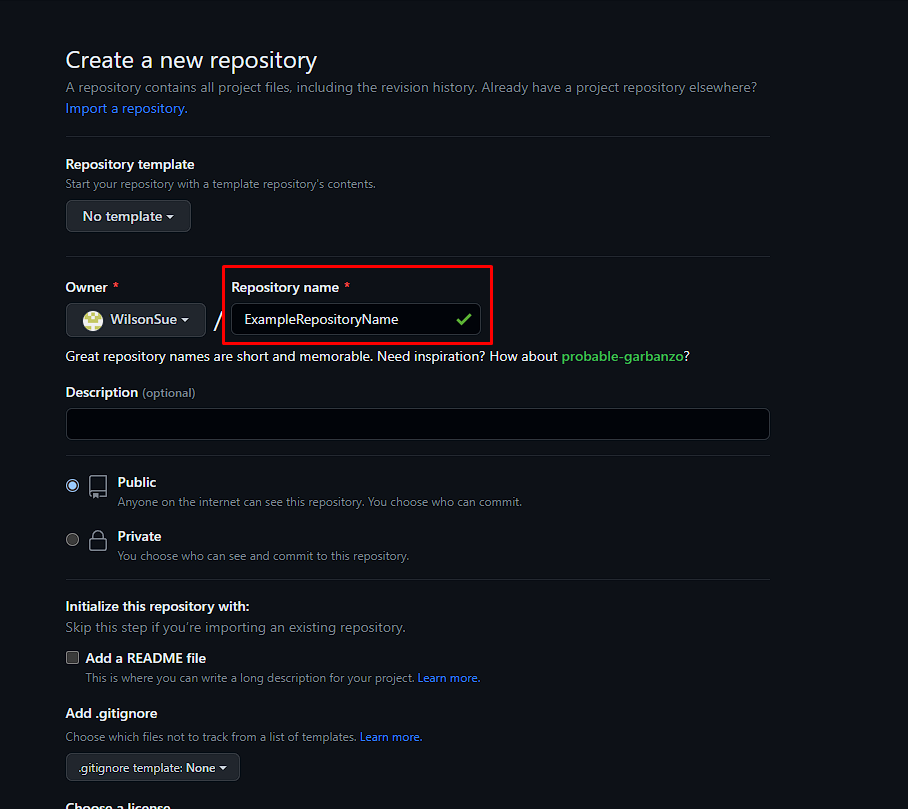
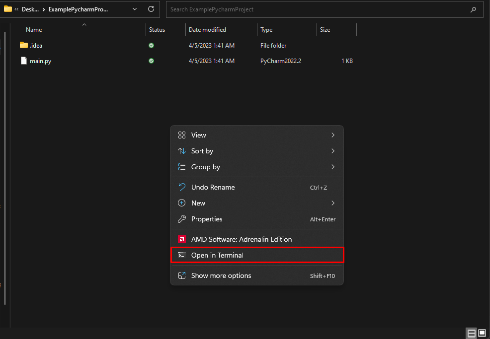
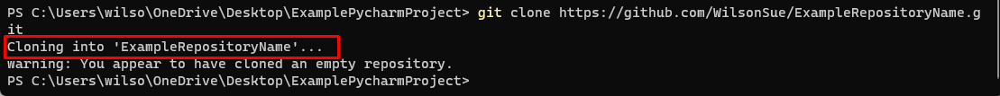
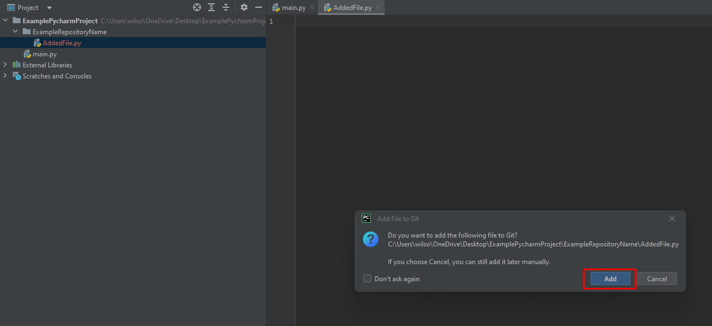
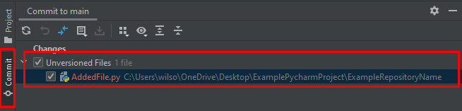
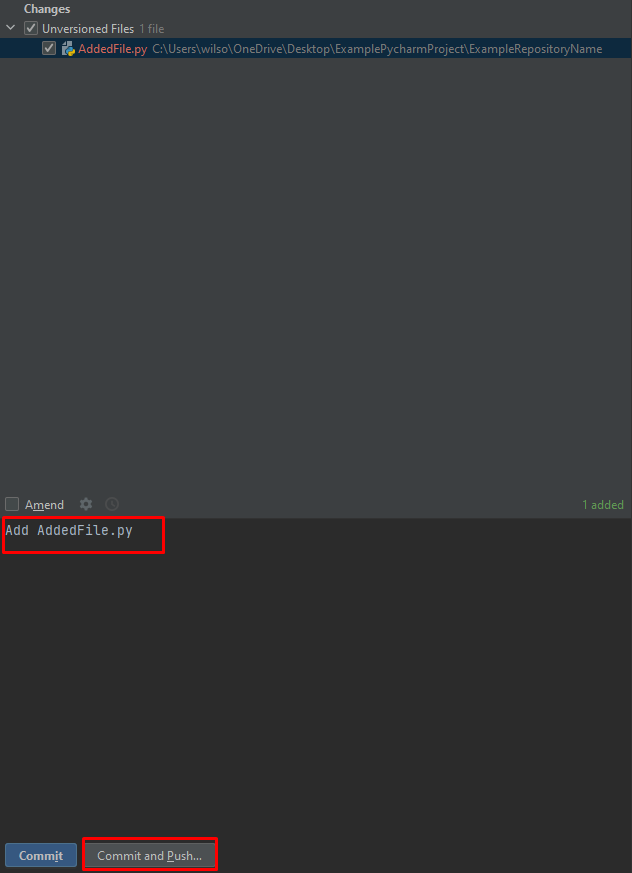

# **How to add Existing Pycharm Projects to GitHub :material-tab-plus:**

## Why add your project to GitHub?

In group projects, as a software developer it's quintessential to share your work with others. 

- Thus, adding your project to github allows you to share your work with others and collaborate with them. 

- Also, github allows users to revert changes, track the code history, and have multiple versions of a project.

- Lastly, it's a portfolio for your projects which can be shared to potential employers.

Now that you've seen the benefits, let's get started!

## How to add your existing PyCharm project to GitHub

1. The first step is to enter the GitHub website (<https://github.com/>).

2. Next is to login / signup if you don't have an account already.
3. Now that you've logged in, click the "+" sign on the top right corner of the page and you’ll see a drop down menu. Click on the first option that says  “New repository”.

4. Enter the title for your repository. Optionally, add a readme.md and .gitignore file.

5. In your GitHub repository, click on the double square button on the right side to copy your github repository link.

6. The next step is to open the folder you want to place your repository inside of. To do so, enter the folder with left click. Next, right click and select the “Open in terminal” option in the drop down menu.

7. Now that you’re in the terminal, type "git clone" followed by a space and then paste the copied URL of the repository. Hit "Enter" to clone the repository to your local machine.

8. Drag the files and folders from your project directory into the repository folder in PyCharm. This will add your project files to the Git repository.  
9. Once you have added the files, a popup window will ask if you want to add the file(s) to github in PyCharm. Click on add so you can commit and push the file. The file text should be green.

10. Left click the commit section on the left, then select all the files you wish to add to your repository.

  
11. Once you’ve selected all the files, write a commit message in the box. Then click the “Commit and Push” button to add the files to your github repository.

## Great Job! Your existing PyCharm project is now added to Git and any changes in the PyCharm project will be tracked, and can be pushed to your remote repository on GitHub

:joy:
