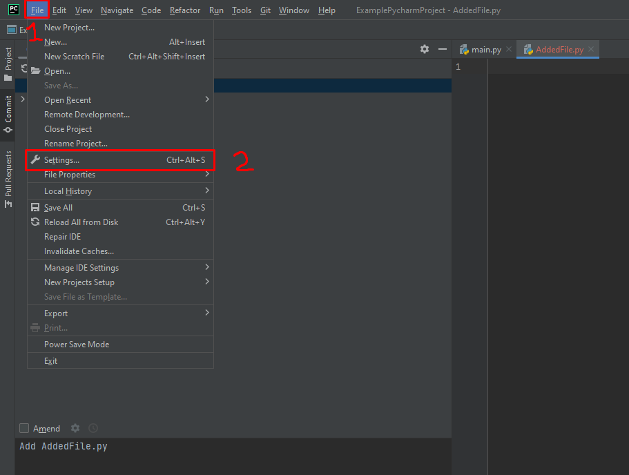
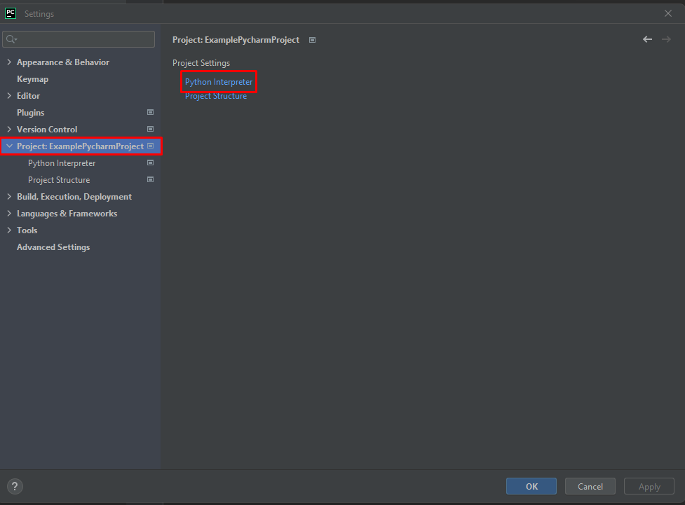
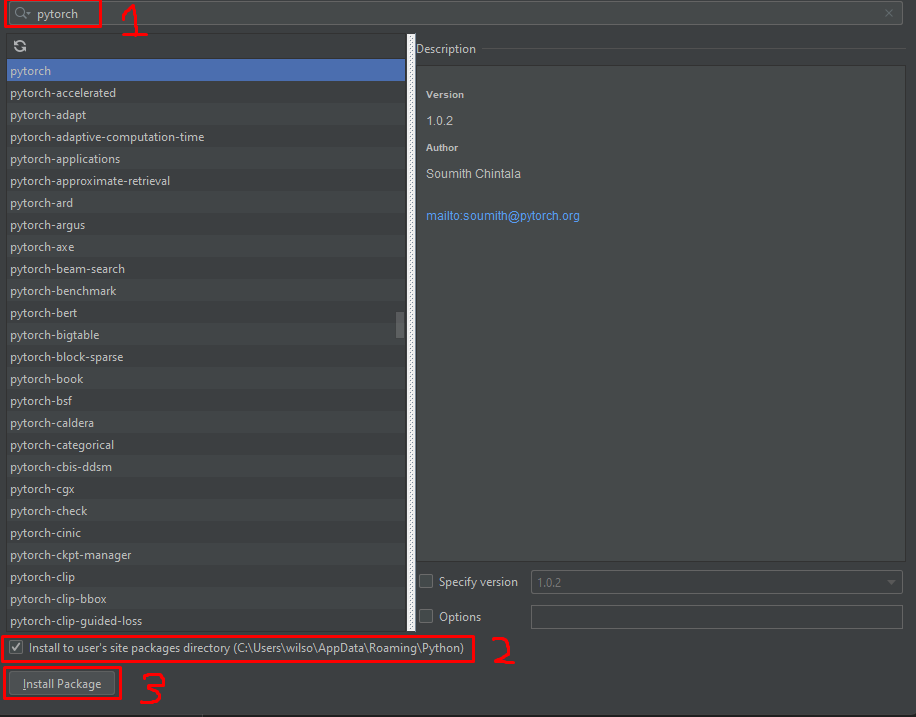
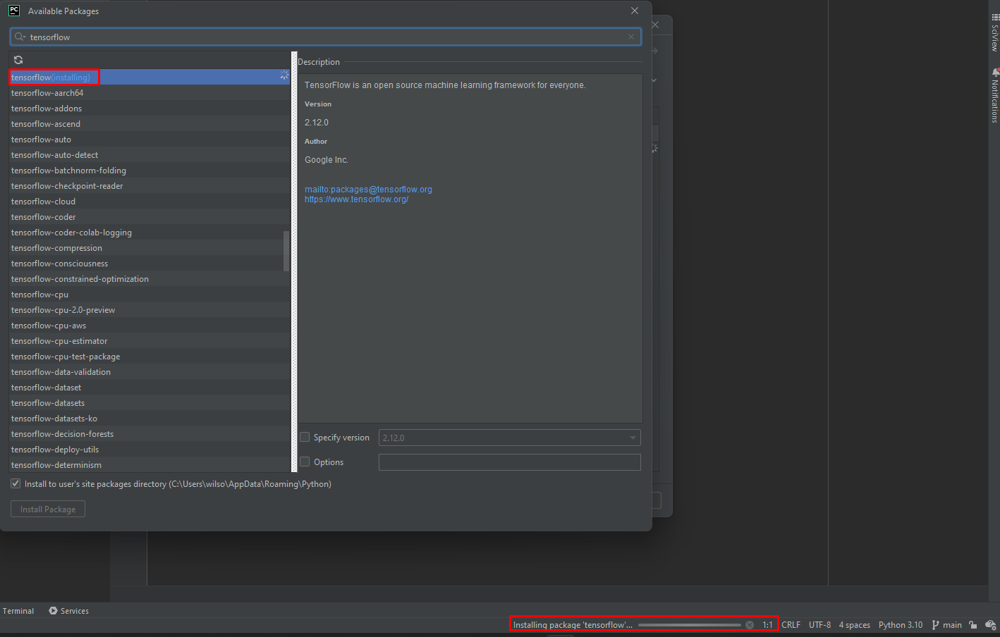
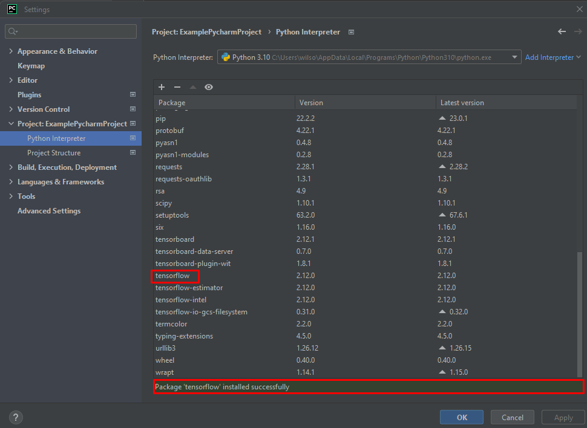
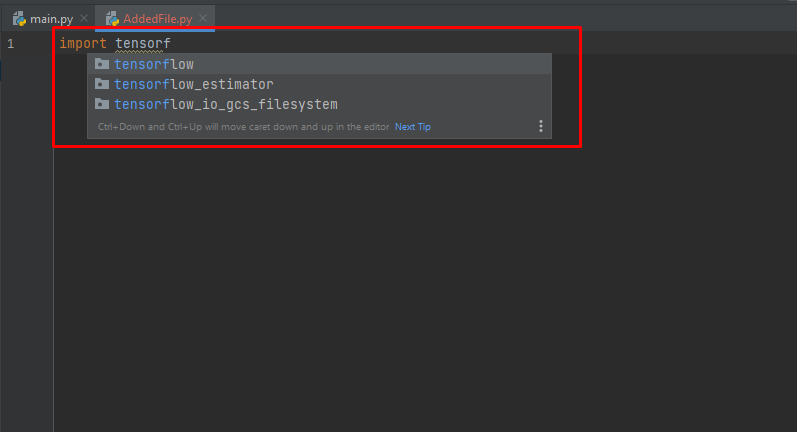

# **How to add External Libraries to Projects**

1. First, you want to start off with finding the external library you wish to add. In this tutorial I’ll be choosing TensorFlow.
2. Open PyCharm and the project you want to add the external library to.
3. Click on "File" in the top left menu bar, and click on "Settings" with the wrench symbol beside it.

4. The next step is to click on the "Project: Project name" located on the left-hand menu. Under “Project Settings”, select the "Python Interpreter" text highlighted in blue. Note that Project name is substituted with the name of your project.

5. Once the Python Interpreter window is opened, a list of installed packages should be shown. To add a new package, click on the "+" button in the bottom left corner or use the keyboard shortcut “Alt” combined with “Insert”.

  
6. Now in the "Available Packages" window, type in the name of the package you want to install on the search bar located at the top. Alternatively, you can also look for your package by scrolling down.  
7. Now that you've found the package, select it. Note that we suggest you tick the bar that says “Install the user’s site packages directory (C:\Users\User\LocationOfPythonFiles)”. This is so that you can locate your package along with your other packages in case you want to find it.

8. Lastly, click on the "Install Package" button in the bottom left corner.

9. PyCharm will now install the package for you. The progress can be seen at the bottom of the PyCharm window.

10. When the package is finished installing. The package should be added to the list with the modules that you’ve already had.
11. You can make sure if the packages are properly installed by typing “import (package name)” into your project and the module name should appear in the drop down menu.

## Amazing! You can now use the new external library in your PyCharm project. Note that if you're using virtual environments,make sure that you can activate the correct environment before installing the package

:joy:
