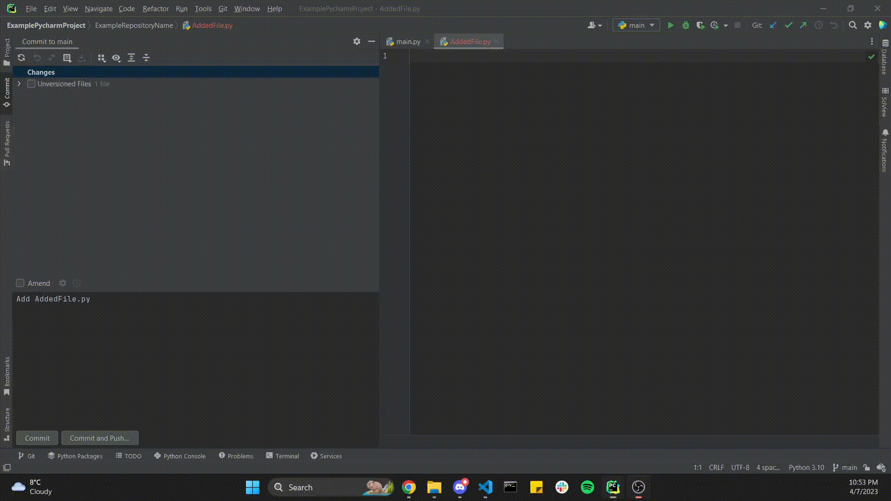
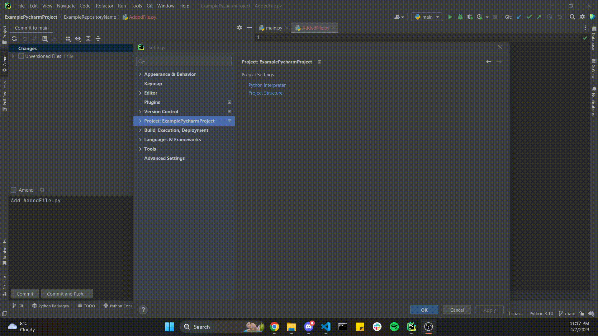
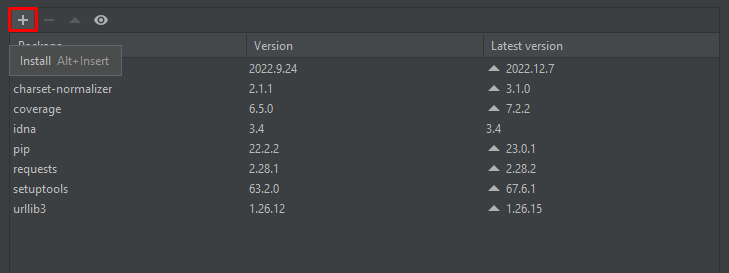
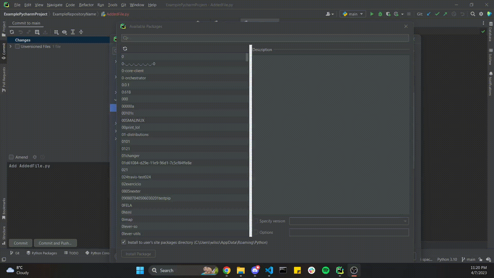
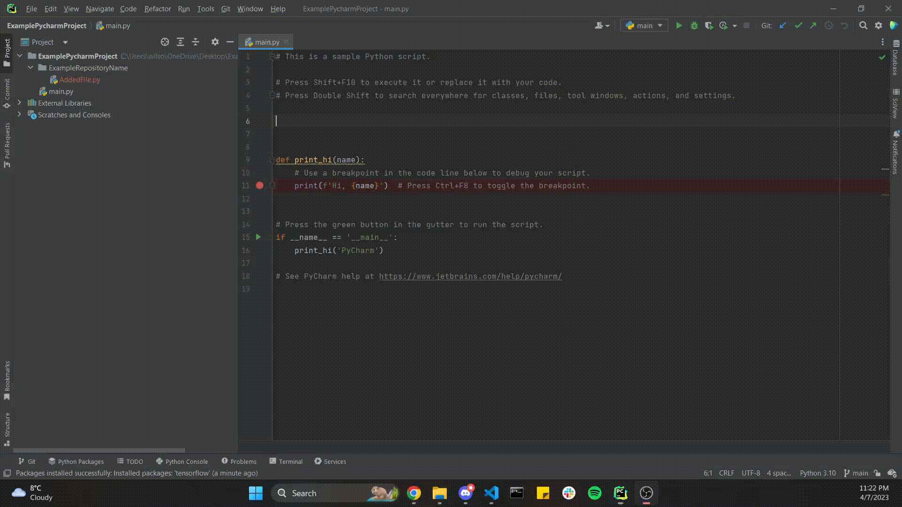

# **How to add External Libraries to Projects**

## What is an External Library and why use it?

An external library is a collection of pre-written code that can be used in your project. It is a collection of functions and methods that you can use in your project without having to write them yourself. This is useful because it allows you to focus on the main aspects of your project, rather than having to write the code for the functions and methods yourself.

## 1. Find the External Library you want to add to your Project

Start off with finding the External Library you wish to add. In this tutorial, I’ll be choosing TensorFlow.

## 2. Open PyCharm and the project you want to add the external library to

## 3. Enter the Settings menu

To do this, click on "File" in the top left menu bar, and click on "Settings" with the wrench symbol beside it.

## 4. Enter the Python Interpreter menu

The next step is to click on the "Project: Project name" located on the left-hand menu. Under “Project Settings”, select the "Python Interpreter" text highlighted in blue. Note that Project name is substituted with the name of your Project.

## 5. Click on the "+" button

Once the Python Interpreter window is opened, a list of installed packages should be shown. To add a new package, click on the "+" button in the bottom left corner or use the keyboard shortcut “Alt” combined with “Insert”.

  

## 6. Enter the name of the package you want to install

In the "Available Packages" window, type in the name of the package you want to install on the search bar located at the top. Alternatively, you can also look for your package by scrolling down.  

## 7. Select the External Library to download

Once you've found the package, select it. Note that we suggest you tick the bar that says “Install the user’s site packages directory (C:\Users\User\LocationOfPythonFiles)”. This is so that you can locate your package along with your other packages in case you want to find it.

## 8. Install the External Library

Click on the "Install Package" button in the bottom left corner.

## 9. Wait for the External Library to install

PyCharm will now install the package for you. The progress can be seen at the bottom of the PyCharm window.

## Double Check if the External Library is installed

When the package is finished installing. The package should be added to the list with the modules that you’ve already had. You can also make sure if the packages are properly installed by typing “import (package name)” into your project and the module name should appear in the drop down menu.

Amazing:smirk:! You can now use the new external library in your PyCharm project :book:. Note that if you're using virtual environments,make sure that you can activate the correct environment before installing the package
