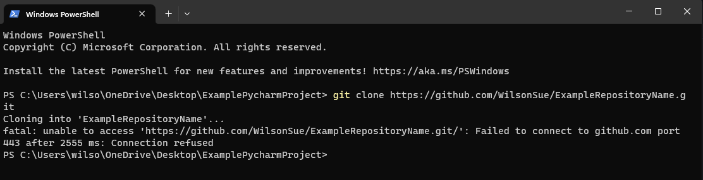
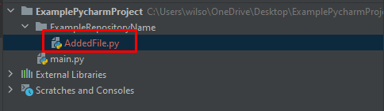
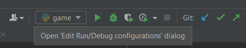
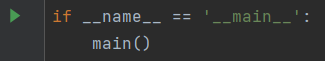

# Troubleshooting

| Issue      | Potential Issues | Solutions |
| ----------- | ----------- |----------- |
|       | Connection refused       |Check your wifi connection or if you're properly signed into github on the terminal       |
|    | Uncommitted File        |Go to the commit section and add file to either commit or commit and push.        |
|     | PyCharm not running/debugging your current file        | Select "current file" in the run/debug menu.  Alternatively, just run the file's _main function_ and it should be added to the run/debug configurations.      |
